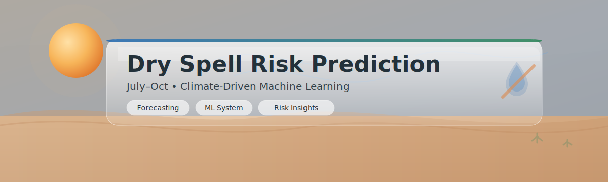

# Dry Spell Risk Prediction (July-Oct)

A climate-driven machine learning project for predicting dry-spell risk in rain-fed agricultural systems using multi-scale atmospheric, hydrological, and oceanic signals.

## Problem Statement

In rain-fed farming systems, crop failure is often caused by rainfall gaps after planting. A short dry spell during early crop development can destroy yields.

This project models the probability of a dry-spell warning during the July-Oct rainy season as a binary classification task:

- 1 = dry-spell warning condition
- 0 = no dry-spell warning

## Objective

Develop a physically informed ML model that:

- Detects patterns leading to dry spells
- Captures multi-day stress persistence
- Integrates local, regional, and global climate signals
- Generalizes across years (2002-2025)

## Modeling Approach

This is a time-series tabular classification problem.

Key characteristics:

- Daily resolution data
- Seasonal window: July-Oct
- Training: 2002-2019
- Test: 2020-2025 (held out)
- Rare-event detection
- Evaluated using accuracy and F1-score (class 1)

## Feature System Design

Dry spells are multi-layer phenomena. The feature set captures interacting climate layers:

1. Local soil water state
2. Atmospheric moisture and heat stress
3. Atmospheric stability and circulation
4. Regional hydrology
5. Large-scale ocean climate drivers

Full physical interpretation is in `data/README.md`.

## Feature Engineering Strategy

Dry spells are persistence-driven events. Feature engineering includes:

- Rolling means (7, 14, 30 days)
- Rolling minimums and maximums
- Trend features
- Lag features
- Stress accumulation indicators

No future leakage is introduced. Time-aware validation is used (no random shuffling).

## Model Development

Baseline models:

- Logistic Regression
- Random Forest
- Gradient Boosting (e.g., XGBoost or LightGBM)

Focus areas:

- F1 optimization for the dry-spell class
- Threshold tuning
- Temporal validation split

## Evaluation

Primary metrics:

- Accuracy
- F1-score (dry-spell class)

Validation strategy:

- Train: early years
- Validation: later years (pre-2020)
- Test: 2020-2025 (hidden during training)

This ensures realistic future generalization.

## Repository Structure

```
dry-spell/
  README.md
  data/
    README.md
  notebooks/
    01_merge_data.ipynb
    02_eda.ipynb
    03_feature_engineering.ipynb
    04_modeling.ipynb
  src/
    features.py
    models.py
    utils.py
  models/
  environment.yml
  requirements.txt
```

## Key Technical Highlights

- Multi-scale climate feature integration
- Physically grounded feature interpretation
- Time-aware validation strategy
- Rare-event classification optimization
- Clean separation between data, modeling, and documentation

## Reproducibility

```bash
conda env create -f environment.yml
conda activate dryspell-ml
jupyter lab
```
